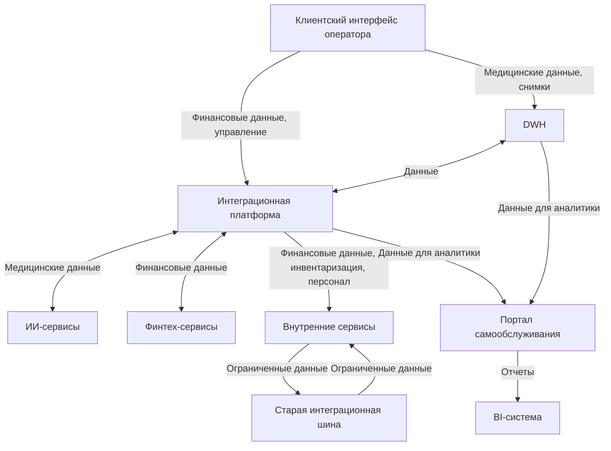
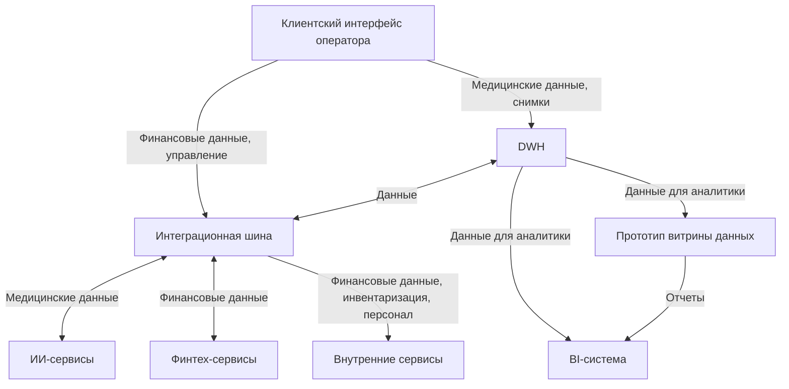

# 1. Анализ потков данных

## 1.1. Финальное состояние (через 1 год)

### Схема потоков данных (TO-BE, финальное состояние)


#### Пояснения
- **Потоки данных**:
    - **Клиентский интерфейс оператора** отправляет медицинские данные в DWH, а финансовые и операционные (инвентаризация, персонал) — через интеграционную платформу.
    - **DWH** хранит все данные, синхронизируется с платформой и передает аналитические данные (финансовые, инвентаризационные, персонал, исключая медицинские карты и исследования) в портал самообслуживания.
    - **Интеграционная платформа** маршрутизирует данные между доменами, передавая медицинские данные в ИИ-сервисы, финансовые — в финтех-сервисы, операционные — во внутренние сервисы, аналитические — в портал.
    - **Портал самообслуживания** получает данные из DWH и платформы, формирует отчеты для бизнес-пользователей и передает их в BI-систему.
    - **Старая интеграционная шина** обслуживает устаревшие внутренние сервисы, имея входы и выходы через них.
    - **BI-система** использует отчеты от портала для аналитики.

- **Роль портала самообслуживания**:
    - Масштабируемый веб-портал для бизнес-пользователей, позволяющий запрашивать аналитические данные, конструировать отчеты и визуализировать дашборды.
    - Исключает медицинские данные, как требуется.
    - Поддерживает интеграцию новых бизнесов (фармацевтика, электроника).

#### Обоснования
- **Замена и сохранение легаси-систем**:
    - **DWH (Microsoft SQL Server 2008)**: Модернизирован до новой версии (например, SQL Server 2019) для повышения производительности. Модернизация быстрее полной замены (6 месяцев).
        - **Обоснование**: Устаревшая версия не справляется с аналитическими нагрузками.
    - **Интеграционная шина (Apache Camel)**: Заменена на платформу для масштабируемости и поддержки новых бизнесов. Старая шина сохранена для устаревших внутренних сервисов.
        - **Обоснование замены**: Camel не масштабируется и не поддерживает новые бизнесы. Платформа (6–9 месяцев) упрощает интеграции.
        - **Обоснование сохранения**: Устаревшие сервисы не успеют мигрировать за год.
        - **Роль платформы**: Маршрутизирует все основные потоки, включая аналитические данные для портала, обеспечивая масштабируемость.
    - **BI-система (Power BI)**: Сохранена, интегрирована с порталом через визуальный интерфейс.
        - **Обоснование**: Сохраняет инвестиции в BI-инфраструктуру.
    - **Клиентский интерфейс (Power Builder)**: Сохранен, так как замена требует переобучения и разработки, что выходит за год.
        - **Обоснование**: Минимизирует риски для операционных процессов.

- **Реалистичность**:
    - Внедрение платформы — 6–9 месяцев.
    - Разработка портала с аналитической СУБД — 9–12 месяцев.
    - Модернизация DWH — 6 месяцев.
    - Сохранение старой шины для устаревших сервисов не требует ресурсов.
    - Все элементы имеют входы и выходы.

- **Бизнес-ценность**:
    - Портал ускоряет аналитику для бизнес-пользователей.
    - Платформа упрощает интеграцию новых бизнесов.
    - Сохранение легаси-систем обеспечивает плавный переход.

## 1.2. Промежуточное состояние (через 2 месяца)

### Схема потоков данных (TO-BE, промежуточное состояние)


#### Пояснения
- **Потоки данных**:
    - **Клиентский интерфейс оператора** отправляет медицинские данные (карты, снимки) в DWH для хранения, а финансовые данные и данные управления (инвентаризация, персонал) — через интеграционную шину для обработки финтех-сервисами и внутренними сервисами.
    - **DWH** хранит все данные, обменивается с шиной для синхронизации и передает аналитические данные (финансовые, инвентаризационные, персонал, исключая медицинские карты и исследования) в прототип витрины данных и BI-систему.
    - **Интеграционная шина** связывает домены (медицинский, финансовый, операционный), передавая медицинские данные в ИИ-сервисы, финансовые — в финтех-сервисы, операционные — во внутренние сервисы.
    - **Прототип витрины данных** получает аналитические данные из DWH, формирует отчеты для бизнес-пользователей и передает их в BI-систему, снижая нагрузку на DWH.
    - **BI-система** использует данные из DWH и прототипа для построения отчетов.

- **Роль прототипа витрины данных**:
    - Веб-портал самообслуживания для бизнес-пользователей, позволяющий запрашивать аналитические данные и конструировать отчеты через визуальный интерфейс.
    - Исключает медицинские данные, как требуется.
    - Тестирует концепцию витрины и ускоряет доступ к аналитике.

#### Обоснования
- **Сохранение легаси-систем**:
    - **DWH (Microsoft SQL Server 2008)**: Сохранен из-за невозможности замены за 2 месяца (сотни терабайт данных, сложная миграция). Оптимизация (индексация, партиционирование) поддерживает прототип витрины.
    - **Интеграционная шина (Apache Camel)**: Сохранена, так как замена требует 6–9 месяцев. Шина поддерживает текущие интеграции и новые маршруты для финансовых данных.
    - **BI-система (Power BI)**: Сохранена, интегрируется с прототипом через визуальный интерфейс, удовлетворяет бизнес-потребности.
    - **Клиентский интерфейс (Power Builder)**: Сохранен, так как замена требует переобучения операторов и разработки, что нереально за 2 месяца.
    - **Роль шины**: Используется для всех потоков, включая клиентский интерфейс и DWH, чтобы сохранить совместимость с текущими процессами финтех- и внутренних сервисов.

- **Реалистичность**:
    - Прототип витрины реализуем за 2 месяца с использованием существующих технологий.
    - Оптимизация DWH и настройка маршрутов в шине — 1–1,5 месяца.
    - Все элементы имеют входы и выходы.

- **Бизнес-ценность**:
    - Прототип витрины решает проблему долгих отчетов.
    - Сохранение легаси-систем минимизирует риски.
    - Шина обеспечивает быстрые изменения в потоках данных.

## 2. Диаграммы компонентов

### 2.1. Текущее состояние (AS-IS)

```plantuml
@startuml
!include https://raw.githubusercontent.com/plantuml-stdlib/C4-PlantUML/master/C4_Container.puml

title Схема C4: Текущее состояние (AS-IS, уровень контейнеров)

Person(operator, "Оператор", "Вводит клиентские данные")
Person(business_user, "Бизнес-пользователь", "Формирует отчеты")

System_Boundary(client_interface, "Клиентский интерфейс оператора") {
  Container(client_ui, "UI приложение", "Power Builder", "Интерфейс для ввода медицинских, финансовых, операционных данных")
}
System_Boundary(dwh_system, "DWH") {
  ContainerDb(dwh_db, "База данных", "Microsoft SQL Server 2008", "Хранит медицинские, финансовые, операционные данные")
  Container(dwh_etl, "ETL-процессы", "SQL/SSIS", "Извлечение, трансформация, загрузка данных")
  Container(metadata_store, "Хранилище метаданных", "SQL", "Схемы данных и правила доступа")
}
System_Boundary(bi_system, "BI-система") {
  Container(bi_app, "BI-приложение", "Power BI", "Визуализация и формирование отчетов")
}
System_Boundary(integration_bus, "Интеграционная шина") {
  Container(bus_service, "Сервис маршрутизации", "Apache Camel", "Маршрутизация данных между сервисами")
  Container(schema_registry, "Реестр схем", "Apache Avro", "Валидация данных")
}
System_Boundary(ai_services, "ИИ-сервисы") {
  Container(ai_processor, "Обработчик данных", "Python", "Анализ медицинских данных")
}
System_Boundary(fintech_services, "Финтех-сервисы") {
  Container(fintech_api, "API-сервис", "Golang/Java", "Финансовые операции и данные")
}
System_Boundary(internal_services, "Внутренние сервисы") {
  Container(internal_api, "API-сервис", "Различные технологии", "Управление клиниками, финансами, инвентаризацией")
}

Rel(operator, client_ui, "Использует", "UI")
Rel(client_ui, bus_service, "Отправляет медицинские, финансовые, операционные данные", "API")
Rel(ai_processor, bus_service, "Отправляет медицинские данные", "API")
Rel(fintech_api, bus_service, "Отправляет финансовые данные", "API")
Rel(internal_api, bus_service, "Отправляет операционные данные", "API")
Rel(bus_service, schema_registry, "Валидирует данные", "API")
Rel(schema_registry, bus_service, "Предоставляет схемы", "API")
Rel(bus_service, dwh_etl, "Отправляет данные", "ETL")
Rel(dwh_etl, metadata_store, "Использует схемы, правила доступа", "SQL")
Rel(dwh_etl, dwh_db, "Загружает данные", "SQL")
Rel(dwh_db, bi_app, "Предоставляет аналитические данные", "SQL")
Rel(business_user, bi_app, "Формирует отчеты", "UI")

@enduml
```

#### Описание
- **Компоненты**:
    - **Клиентский интерфейс**: UI-приложение (Power Builder) для ввода медицинских, финансовых и операционных данных оператором.
    - **DWH**: База данных (SQL Server 2008) хранит все данные, ETL-процессы (SSIS) трансформируют данные, хранилище метаданных (SQL) управляет схемами.
    - **BI-система**: BI-приложение (Power BI) формирует отчеты.
    - **Интеграционная шина**: Сервис маршрутизации (Apache Camel) передает данные, реестр схем (Apache Avro) валидирует схемы.
    - **ИИ-сервисы**: Обработчик (Python) анализирует медицинские данные.
    - **Финтех-сервисы**: API-сервис (Golang/Java) управляет финансами.
    - **Внутренние сервисы**: API-сервис (различные технологии) управляет клиниками и инвентаризацией.
- **Потоки данных**:
    - Оператор через UI отправляет медицинские, финансовые, операционные данные в шину.
    - Сервисы (ИИ, финтех, внутренние) отправляют данные через шину, валидируя в реестре схем, в ETL-процессы DWH.
    - ETL-процессы используют метаданные и загружают данные в базу DWH.
    - DWH передает аналитические данные (исключая медицинские карты и исследования) в BI-приложение по запросам.
    - Бизнес-пользователь формирует отчеты через BI-приложение.

### 2.2. Финальное состояние (через 1 год)

```plantuml
@startuml
!include https://raw.githubusercontent.com/plantuml-stdlib/C4-PlantUML/master/C4_Container.puml

title Схема C4: Финальное состояние (через 1 год, уровень контейнеров)

Person(operator, "Оператор", "Вводит клиентские данные")
Person(business_user, "Бизнес-пользователь", "Формирует аналитику и отчеты")

System_Boundary(client_interface, "Клиентский интерфейс оператора") {
  Container(client_ui, "UI приложение", "Power Builder", "Интерфейс для ввода медицинских, финансовых, операционных данных")
}
System_Boundary(dwh_system, "DWH") {
  ContainerDb(dwh_db, "База данных", "Microsoft SQL Server 2019", "Хранит медицинские, финансовые, операционные данные")
  Container(dwh_etl, "ETL-процессы", "SQL/SSIS", "Извлечение, трансформация, загрузка данных")
  Container(metadata_store, "Хранилище метаданных", "SQL", "Схемы данных и правила доступа")
}
System_Boundary(bi_system, "BI-система") {
  Container(bi_app, "BI-приложение", "Power BI", "Визуализация и формирование отчетов")
}
System_Boundary(self_service_portal, "Портал самообслуживания") {
  Container(portal_app, "Веб-портал", "Java/Spring", "Интерфейс для аналитики бизнес-пользователей")
  ContainerDb(portal_db, "Аналитическая СУБД", "Snowflake", "Хранит агрегированные аналитические данные")
  Container(search_engine, "Поисковый движок", "Elasticsearch", "Поиск по аналитическим данным")
  Container(data_catalog, "Каталог данных", "DataHub", "Поиск, lineage, управление метаданными")
}
System_Boundary(integration_platform, "Интеграционная платформа") {
  Container(bus_service, "Сервис маршрутизации", "Kafka", "Маршрутизация данных между сервисами")
  Container(schema_registry, "Реестр схем", "Confluent Schema Registry", "Валидация данных")
  ContainerDb(object_storage, "Объектное хранилище", "MinIO, Apache Iceberg", "Хранение сырых данных с табличным форматом")
}
System_Boundary(integration_bus, "Старая интеграционная шина") {
  Container(old_bus_service, "Сервис маршрутизации", "Apache Camel", "Маршрутизация для устаревших сервисов")
}
System_Boundary(ai_services, "ИИ-сервисы") {
  Container(ai_processor, "Обработчик данных", "Python", "Анализ медицинских данных")
}
System_Boundary(fintech_services, "Финтех-сервисы") {
  Container(fintech_api, "API-сервис", "Golang/Java", "Финансовые операции и данные")
}
System_Boundary(internal_services, "Внутренние сервисы") {
  Container(internal_api, "API-сервис", "Различные технологии", "Управление клиниками, финансами, инвентаризацией")
}

Rel(operator, client_ui, "Использует", "UI")
Rel(client_ui, bus_service, "Отправляет медицинские, финансовые, операционные данные", "API")
Rel(ai_processor, bus_service, "Отправляет медицинские данные", "API")
Rel(fintech_api, bus_service, "Отправляет финансовые данные", "API")
Rel(internal_api, bus_service, "Отправляет операционные данные", "API")
Rel(bus_service, schema_registry, "Валидирует данные", "API")
Rel(schema_registry, bus_service, "Предоставляет схемы", "API")
Rel(bus_service, object_storage, "Сохраняет сырые данные", "API")
Rel(bus_service, dwh_etl, "Отправляет данные", "ETL")
Rel(object_storage, dwh_etl, "Предоставляет сырые данные", "API")
Rel(dwh_etl, metadata_store, "Использует схемы, правила доступа", "SQL")
Rel(dwh_etl, dwh_db, "Загружает данные", "SQL")
Rel(dwh_db, data_catalog, "Отправляет метаданные", "API")
Rel(object_storage, data_catalog, "Отправляет метаданные", "API")
Rel(portal_db, data_catalog, "Отправляет метаданные", "API")
Rel(data_catalog, portal_db, "Предоставляет метаданные, lineage", "API")
Rel(portal_app, portal_db, "Инициирует запросы данных", "SQL")
Rel(portal_db, dwh_db, "Запрашивает аналитические данные", "SQL")
Rel(bus_service, portal_db, "Предоставляет аналитические данные", "API")
Rel(portal_db, portal_app, "Передает данные", "SQL")
Rel(portal_app, search_engine, "Индексирует данные для поиска", "API")
Rel(search_engine, portal_app, "Предоставляет результаты поиска", "API")
Rel(portal_app, data_catalog, "Запрашивает метаданные", "API")
Rel(portal_app, bi_app, "Передает отчеты", "API")
Rel(business_user, portal_app, "Запрашивает аналитику", "UI")
Rel(business_user, data_catalog, "Ищет данные", "UI")
Rel(business_user, bi_app, "Формирует отчеты", "UI")
Rel(old_bus_service, internal_api, "Передает ограниченные данные", "API")
Rel(internal_api, old_bus_service, "Отправляет ограниченные данные", "API")

@enduml
```

#### Описание
- **Компоненты**:
    - **Клиентский интерфейс**: UI-приложение (Power Builder) для ввода данных.
    - **DWH**: База данных (SQL Server 2019) хранит данные, ETL-процессы (SSIS) трансформируют данные, хранилище метаданных (SQL) управляет схемами.
    - **BI-система**: BI-приложение (Power BI) для отчетов.
    - **Портал самообслуживания**: Веб-портал (Java/Spring) для аналитики, Snowflake (аналитическая СУБД) хранит агрегированные данные, Elasticsearch (поисковый движок) ускоряет поиск, DataHub (каталог данных) управляет метаданными.
    - **Интеграционная платформа**: Kafka (маршрутизация) передает данные, Confluent Schema Registry валидирует схемы, MinIO с Apache Iceberg хранит сырые данные.
    - **Старая интеграционная шина**: Apache Camel для устаревших сервисов.
    - **ИИ-сервисы**, **Финтех-сервисы**, **Внутренние сервисы**: Как в AS-IS.
- **Потоки данных**:
    - Оператор отправляет медицинские, финансовые, операционные данные через платформу (Kafka).
    - Сервисы (ИИ, финтех, внутренние) отправляют данные через платформу, валидируя в реестре схем, в MinIO (Iceberg) и ETL-процессы DWH.
    - MinIO передает сырые данные в ETL-процессы.
    - ETL-процессы используют метаданные DWH и загружают данные в базу DWH.
    - Snowflake запрашивает исторические аналитические данные (финансовые, операционные, исключая медицинские) из DWH через SQL и получает потоковые данные от Kafka через API.
    - Веб-портал инициирует запросы к Snowflake, которая передает данные для аналитики.
    - Snowflake, MinIO и DWH отправляют метаданные (схемы, доступ, lineage) в DataHub, который предоставляет их порталу.
    - Веб-портал индексирует данные в Elasticsearch, передает отчеты в BI-приложение.
    - Бизнес-пользователь запрашивает аналитику через веб-портал, ищет данные в DataHub, формирует отчеты через BI.
    - Устаревшие сервисы обмениваются данными через старую шину.

#### Обоснования
- **Соответствие финальному состоянию**: Схема отражает переход к **Data Mesh** и **Data Lakehouse**:
    - **Data Mesh**: Домены (Медицинский, Финансовый, Операционный, Аналитический) автономны благодаря локальным хранилищам (в доменах) и платформе (Kafka). Портал — продукт данных, DataHub — единый каталог, обеспечивающий поиск, lineage, комплаенс.
    - **Data Lakehouse**: MinIO с Iceberg (объектное хранилище, табличный формат) хранит сырые данные, Snowflake обрабатывает аналитические, поддерживая гибрид структурированных/неструктурированных данных.
- **Схема потоков**:
    - Клиентский интерфейс отправляет медицинские данные в DWH, финансовые/операционные — через платформу (ранее шину).
    - Snowflake (аналог прототипа витрины) запрашивает аналитические данные из DWH и получает потоковые данные от Kafka.
    - DataHub собирает метаданные, заменяя локальные хранилища метаданных портала.
- **Объектное хранилище**: MinIO в интеграционной платформе хранит сырые данные (логи, транзакции), разгружая DWH, которое фокусируется на архивации. Iceberg обеспечивает транзакции и версионирование, поддерживая **Data Lakehouse**. Размещение в платформе упрощает потоковую обработку через Kafka.
- **Реестр схем**: Confluent Schema Registry валидирует схемы данных в Kafka, обеспечивая согласованность при передаче в MinIO, DWH или Snowflake, что критично для **Data Mesh**.
- **Snowflake и DWH**: Snowflake запрашивает исторические данные из DWH через SQL для глубокого анализа, а Kafka предоставляет потоковые данные для реального времени, поддерживая оперативную и долгосрочную аналитику в **Data Lakehouse**.
- **DataHub**: Централизует метаданные от DWH, MinIO, Snowflake, обеспечивая поиск, lineage, комплаенс, как в **Data Mesh**.
- **Реалистичность**: Внедрение Kafka, MinIO, Iceberg (6–9 месяцев), Snowflake, Elasticsearch, DataHub (9–12 месяцев) возможно за 1 год, учитывая ресурсы компании (ИТ-отдел, серверы для сотен терабайт).
- **Бизнес-ценность**: Портал ускоряет аналитику, платформа и MinIO поддерживают новые бизнесы, DataHub упрощает поиск данных, медицинские данные исключены из аналитики, DWH разгружен для архивации.


### 2.3. Промежуточное состояние (через 2 месяца)

```plantuml
@startuml
!include https://raw.githubusercontent.com/plantuml-stdlib/C4-PlantUML/master/C4_Container.puml

title Схема C4: Промежуточное состояние (через 2 месяца, уровень контейнеров)

Person(operator, "Оператор", "Вводит клиентские данные")
Person(business_user, "Бизнес-пользователь", "Формирует аналитику и отчеты")

System_Boundary(client_interface, "Клиентский интерфейс оператора") {
  Container(client_ui, "UI приложение", "Power Builder", "Интерфейс для ввода медицинских, финансовых, операционных данных")
}
System_Boundary(dwh_system, "DWH") {
  ContainerDb(dwh_db, "База данных", "Microsoft SQL Server 2008", "Хранит медицинские, финансовые, операционные данные")
  Container(dwh_etl, "ETL-процессы", "SQL/SSIS", "Извлечение, трансформация, загрузка данных")
  Container(metadata_store, "Хранилище метаданных", "SQL", "Схемы данных и правила доступа")
}
System_Boundary(bi_system, "BI-система") {
  Container(bi_app, "BI-приложение", "Power BI", "Визуализация и формирование отчетов")
}
System_Boundary(data_mart_prototype, "Прототип витрины данных") {
  Container(data_mart_app, "Веб-портал", "Python/Django", "Интерфейс для аналитики бизнес-пользователей")
  ContainerDb(data_mart_db, "Кэш данных", "SQL", "Хранит агрегированные аналитические данные")
  Container(data_mart_metadata, "Метаданные витрины", "SQL", "Управление схемами и доступом витрины")
}
System_Boundary(integration_bus, "Интеграционная шина") {
  Container(bus_service, "Сервис маршрутизации", "Apache Camel", "Маршрутизация данных между сервисами")
  Container(schema_registry, "Реестр схем", "Apache Avro", "Валидация данных")
}
System_Boundary(ai_services, "ИИ-сервисы") {
  Container(ai_processor, "Обработчик данных", "Python", "Анализ медицинских данных")
}
System_Boundary(fintech_services, "Финтех-сервисы") {
  Container(fintech_api, "API-сервис", "Golang/Java", "Финансовые операции и данные")
}
System_Boundary(internal_services, "Внутренние сервисы") {
  Container(internal_api, "API-сервис", "Различные технологии", "Управление клиниками, финансами, инвентаризацией")
}

Rel(operator, client_ui, "Использует", "UI")
Rel(client_ui, dwh_db, "Отправляет медицинские данные", "SQL")
Rel(client_ui, bus_service, "Отправляет финансовые, операционные данные", "API")
Rel(dwh_db, bus_service, "Передает данные", "ETL")
Rel(bus_service, dwh_etl, "Отправляет данные", "ETL")
Rel(ai_processor, bus_service, "Отправляет медицинские данные", "API")
Rel(fintech_api, bus_service, "Отправляет финансовые данные", "API")
Rel(internal_api, bus_service, "Отправляет операционные данные", "API")
Rel(bus_service, schema_registry, "Валидирует данные", "API")
Rel(schema_registry, bus_service, "Предоставляет схемы", "API")
Rel(dwh_etl, metadata_store, "Использует схемы, правила доступа", "SQL")
Rel(dwh_etl, dwh_db, "Загружает данные", "SQL")
Rel(dwh_db, data_mart_db, "Предоставляет аналитические данные", "SQL")
Rel(dwh_db, bi_app, "Предоставляет аналитические данные", "SQL")
Rel(data_mart_db, data_mart_app, "Передает данные", "SQL")
Rel(data_mart_app, data_mart_metadata, "Управляет схемами, доступом", "SQL")
Rel(data_mart_app, bi_app, "Передает отчеты", "API")
Rel(business_user, data_mart_app, "Запрашивает аналитику", "UI")
Rel(business_user, bi_app, "Формирует отчеты", "UI")

@enduml
```
#### Описание
- **Компоненты**:
    - Как в AS-IS, плюс **прототип витрины данных**: Веб-портал (Python/Django) для аналитики, кэш данных (SQL) для агрегированных данных, метаданные витрины (SQL) для схем и доступа.
- **Потоки данных**:
    - Оператор отправляет медицинские данные в DWH, финансовые и операционные — в шину.
    - DWH передает данные в шину через ETL для синхронизации.
    - Сервисы (ИИ, финтех, внутренние) отправляют данные через шину, валидируя в реестре схем, в ETL-процессы DWH.
    - ETL-процессы используют метаданные DWH и загружают данные в базу.
    - DWH передает аналитические данные (исключая медицинские карты и исследования) в кэш витрины и BI-приложение по запросам.
    - Веб-портал витрины получает данные из кэша, управляет доступом через метаданные витрины, передает отчеты в BI-приложение.
    - Бизнес-пользователь запрашивает аналитику через веб-портал и отчеты через BI.

#### Обоснования
- **Соответствие промежуточному состоянию**: Введен прототип витрины как первый шаг к **Data Mesh** (продукт данных), разгружающий DWH. Потоки соответствуют схеме: медицинские данные в DWH, финансовые/операционные через шину, аналитические данные в витрину и BI.
- **Data Mesh**: Прототип витрины — продукт данных аналитического домена, метаданные витрины обеспечивают автономность, но без полноценного каталога данных.
- **Data Lakehouse**: Частичное соответствие, так как SQL кэш — шаг к структурированным данным, но нет объектного хранилища.
- **Реалистичность**: Внедрение прототипа (Python/Django, SQL) и оптимизация DWH возможны за 2 месяца.
- **Бизнес-ценность**: Прототип ускоряет аналитику, снижает нагрузку на ИТ, поддерживает переход к финальному состоянию.

## 3. Проблемы текущей архитектуры с приоритетами их решения

| **Проблемное место** | **Описание проблемы (для бизнеса)** | **Влияние на бизнес** | **Технические аспекты (для инженеров)** | **Приоритет (MoSCoW)** |
|----------------------|------------------------------------|-----------------------|-----------------------------------------|------------------------|
| **Долгое время формирования отчетов** | Отчеты для принятия решений (например, по финансам или инвентаризации) формируются часами, что замедляет работу менеджеров и аналитиков. | Задержки в принятии решений, снижение конкурентоспособности, упущенные возможности из-за отсутствия оперативной аналитики. | DWH (SQL Server 2008) перегружен из-за больших объемов данных (сотни терабайт) и сложных трансформаций в ETL-процессах (SSIS). Отсутствие кэширования и оптимизации запросов. | **Must have** |
| **Устаревшая интеграционная шина** | Система обмена данными между сервисами (ИИ, финтех, клиники) не справляется с ростом компании, что усложняет добавление новых бизнесов, таких как фармацевтика. | Ограничения в расширении бизнеса, высокие затраты на интеграцию новых систем, риск сбоев в обмене данными. | Интеграционная шина (Apache Camel) не масштабируется, не поддерживает событийно-ориентированную архитектуру, имеет ограниченную пропускную способность. | **Should have** |
| **Ограниченное управление метаданными** | Нет единой системы, которая бы четко описывала, какие данные где хранятся и как их использовать, что затрудняет аналитику и контроль доступа. | Риск ошибок в отчетах, сложности с соблюдением требований к конфиденциальности данных, лишние затраты на ручную проверку данных. | Хранилище метаданных в DWH (SQL) минимально, нет централизованного каталога данных или инструментов для управления схемами и доступом. Реестр схем (Avro) ограничен валидацией. | **Could have** |
| **Устаревший DWH** | Центральное хранилище данных работает на старом программном обеспечении, что замедляет обработку и увеличивает риск сбоев. | Низкая производительность аналитики, потенциальные убытки из-за простоев, невозможность быстро адаптироваться к новым требованиям. | SQL Server 2008 устарел, не поддерживает современные оптимизации (например, columnstore индексы), имеет низкую производительность при больших нагрузках. | **Must have** |
| **Отсутствие портала самообслуживания** | Бизнес-пользователи зависят от аналитиков для получения отчетов, что замедляет доступ к данным и увеличивает нагрузку на ИТ-отдел. | Задержки в принятии решений, высокая стоимость поддержки аналитиков, ограниченная гибкость в анализе данных. | Нет веб-портала для самостоятельной аналитики, вся нагрузка ложится на DWH и BI-приложение (Power BI), что усугубляет перегрузку. | **Must have** |
| **Устаревший клиентский интерфейс** | Интерфейс для операторов в клиниках сложен в использовании и несовместим с современными технологиями, что снижает эффективность работы. | Замедление операционных процессов, необходимость переобучения персонала, риск ошибок при вводе данных. | Power Builder устарел, не поддерживает веб-интерфейсы, сложен в интеграции с новыми системами, требует значительных ресурсов для обновления. | **Could have** |
| **Недостаточная масштабируемость для новых бизнесов** | Текущая система не готова к интеграции новых направлений (фармацевтика, электроника), что ограничивает рост компании. | Упущенные возможности для расширения, высокие затраты на доработку системы, задержки в запуске новых проектов. | Архитектура монолитна, шина и DWH не справляются с увеличением объема данных и интеграций, отсутствует событийно-ориентированная модель. | **Should have** |
| **Отсутствие обработки потоковых данных в реальном времени** | Данные обрабатываются с задержками, что мешает оперативно реагировать на изменения, например, в финансовых транзакциях или инвентаризации. | Потеря конкурентных преимуществ из-за отсутствия мгновенной аналитики, риск финансовых потерь из-за задержек. | Отсутствует платформа для потоковой обработки (например, Kafka), шина (Camel) работает в пакетном режиме, DWH не оптимизирован для реального времени. | **Could have** |
| **Слабая защита данных и соответствие требованиям конфиденциальности** | Нет строгого контроля доступа к данным, что увеличивает риск утечек, особенно для финансовых и персональных данных. | Штрафы за несоблюдение законов о защите данных, репутационные потери, недоверие клиентов. | Отсутствуют централизованные механизмы управления доступом и аудита. Хранилище метаданных не поддерживает детализированные политики безопасности. | **Must have** |
| **Отсутствие каталога данных** | Бизнес-пользователи и аналитики не знают, какие данные доступны и как их найти, что усложняет поиск нужной информации. | Увеличение времени на анализ данных, дублирование усилий аналитиков, низкая эффективность использования данных. | Нет единого каталога данных (аналог DataHub), метаданные разрознены, отсутствует поиск по данным и их описаниям. | **Could have** |

### Пояснения к приоритизации (MoSCoW)
- **Must have** (обязательно решить):
    - **Долгое время формирования отчетов**: Критично для оперативной аналитики, напрямую влияет на принятие решений. Реализация прототипа витрины (2 месяца) решает проблему.
    - **Устаревший DWH**: Основа системы, его низкая производительность и риски сбоев угрожают всей аналитике. Модернизация до SQL Server 2019 обязательна.
    - **Отсутствие портала самообслуживания**: Ключевая цель бизнеса — дать пользователям самостоятельный доступ к данным, снижая нагрузку на ИТ. Прототип витрины — первый шаг.
    - **Слабая защита данных**: Несоблюдение конфиденциальности влечет штрафы и репутационные потери, особенно для финансовых данных. Требует немедленного аудита и усиления контроля доступа.
- **Should have** (важно, но не срочно):
    - **Устаревшая интеграционная шина**: Важна для масштабирования и новых бизнесов, но замена на платформу (Kafka) требует 6–9 месяцев, поэтому откладывается до финального состояния.
    - **Недостаточная масштабируемость**: Связана с шиной и архитектурой, решается в финальном состоянии через новую платформу, но не критично для промежуточного этапа.
- **Could have** (желательно, но необязательно):
    - **Ограниченное управление метаданными**: Улучшит аналитику, но не срочно, так как базовые метаданные уже есть. Полное решение (каталог данных) возможно в финальном состоянии.
    - **Устаревший клиентский интерфейс**: Влияет на операционные процессы, но замена Power Builder требует значительных ресурсов и переобучения, что выходит за год.
    - **Отсутствие потоковой обработки**: Полезно для финтеха, но не критично для текущих процессов, которые справляются с пакетной обработкой. Реализуется в финальном состоянии (Kafka).
    - **Отсутствие каталога данных**: Упрощает поиск данных, но не является приоритетом, так как аналитики могут работать с текущими метаданными. Реализуется позже.

### Обоснования
- **Критерии приоритизации**:
    - **Влияние на бизнес**: Проблемы с высоким риском (штрафы, потери, задержки решений) — Must have.
    - **Срочность**: Проблемы, решаемые в промежуточном состоянии (2 месяца, например, прототип витрины), — Must have.
    - **Сложность и сроки**: Долгосрочные задачи (замена шины, масштабируемость) — Should have или Could have.
    - **Соответствие целям**: Оперативная аналитика, конфиденциальность, снижение нагрузки на ИТ — приоритетны.
- **Соответствие контексту**: Проблемы привязаны к текущей архитектуре (DWH, Camel, Power BI) и бизнес-целям (аналитика, новые бизнесы). Must have задачи решают ключевые боли (отчеты, защита данных), Should have поддерживают рост, Could have улучшают эффективность.
- **Понятность**: Приоритеты объясняют, почему проблема критична (например, «штрафы за утечки») или отложена (например, «замена шины требует 6–9 месяцев»).

