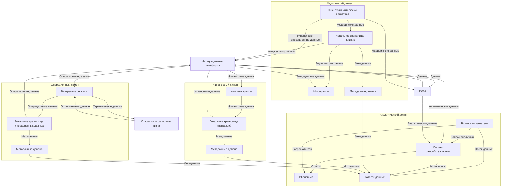
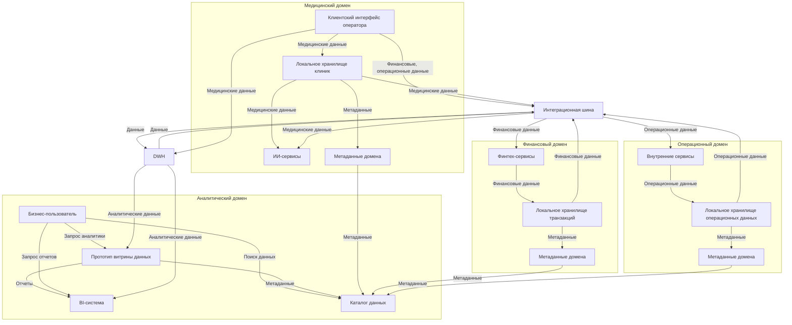

# 1. Разделение системы на домены

## Таблица доменов

| **Домен** | **Подразделение** | **Описание и функциональность** | **Данные** | **Сервисы и компоненты** | **Границы и независимость** |
|-----------|-------------------|---------------------------------|------------|--------------------------|-----------------------------|
| **Медицинский домен** | Клиники, ИИ-сервисы | Управляет медицинскими процессами: прием пациентов, диагностика, лечение, анализ медицинских данных с помощью ИИ. | Медицинские карты, истории болезней, результаты исследований, снимки. | - Клиентский интерфейс оператора (Power Builder) - ИИ-сервисы (Python, обработчик данных) - Локальное хранилище данных клиник (SQL/NoSQL) - API для обмена медицинскими данными | - Данные хранятся локально в клиниках, передаются в DWH только для архивации. - ИИ-сервисы автономно обрабатывают данные через API. - Независимость от DWH достигается локальным хранилищем и прямой интеграцией с интеграционной платформой. |
| **Финансовый домен** | Финтех-сервисы | Управляет финансовыми операциями: кредиты, счета, транзакции, банковские услуги для клиентов. | Финансовая история, счета, данные о кредитах, транзакции. | - Финтех-сервисы (Golang/Java, API-сервис) - Локальное хранилище транзакций (SQL/NoSQL) - API для финансовых операций - Модуль аналитики транзакций | - Локальное хранилище обрабатывает транзакции в реальном времени. - Данные в DWH отправляются только для аналитики. - Интеграция через платформу (Kafka) без новой логики в DWH. |
| **Операционный домен** | Клиники, Головной офис | Управляет операционной деятельностью: персонал, инвентаризация, управление клиниками, финансовая отчетность офиса. | Данные о персонале, инвентаризации, внутренней финансовой отчетности, логистика. | - Внутренние сервисы (API-сервис, различные технологии) - Локальное хранилище операционных данных (SQL) - API для управления клиниками - Модуль отчетности офиса | - Локальное хранилище поддерживает операционные процессы. - Данные в DWH — для консолидированной аналитики. - Интеграция через платформу, старая шина для устаревших сервисов. |
| **Аналитический домен** | Головной офис | Обеспечивает аналитику для принятия решений: финансовые тренды, операционные показатели, без медицинских данных. | Агрегированные финансовые, операционные, инвентаризационные данные. | - Прототип витрины данных (2 месяца, Python/Django, SQL кэш) - Портал самообслуживания (1 год, Java/Spring, Snowflake, Elasticsearch) - BI-система (Power BI) - Хранилище метаданных (SQL/NoSQL) - Реестр схем (Confluent) | - Данные агрегируются из других доменов через интеграционную платформу. - Портал и BI-приложение работают автономно, не требуя логики в DWH. - Медицинские данные исключены. |

### Аргументация логики разделения на домены

Логика разделения системы на четыре домена (Медицинский, Финансовый, Операционный, Аналитический) основана на следующих принципах и требованиях:

1. **Соответствие структуре компании**:
    - **Головной офис**: Фокусируется на стратегической аналитике и управлении, что соответствует аналитическому домену (портал самообслуживания, BI) и частично операционному домену (отчетность, координация).
    - **Клиники**: Основной источник медицинских данных (медицинский домен) и операционных данных (управление персоналом, инвентаризацией), что отражено в медицинском и операционном доменах.
    - **ИИ-сервисы**: Автономная компания, специализирующаяся на анализе медицинских данных, полностью интегрирована в медицинский домен.
    - **Финтех-сервисы**: Отдельная компания с банковской лицензией, управляет финансовыми операциями, что соответствует финансовому домену.

2. **Функциональная изоляция (DDD)**:
    - Каждый домен имеет четко определенную функциональность: медицинский — лечение и анализ, финансовый — транзакции, операционный — управление, аналитический — отчетность. Это минимизирует пересечение обязанностей.
    - Границы доменов определены по типам данных: медицинские данные изолированы, финансовые и операционные отделены от аналитики, что соответствует требованию исключения медицинских данных из аналитики.
    - Локальные хранилища (SQL/NoSQL) в каждом домене обеспечивают автономность, позволяя обрабатывать данные без вмешательства в DWH.

3. **Независимость от DWH**:
    - **Локальные хранилища**: Медицинский (клиники), финансовый (транзакции) и операционный (управление) домены используют собственные хранилища для оперативных данных, отправляя в DWH только агрегированные данные для архивации или аналитики.
    - **Интеграционная платформа**: В финальном состоянии (Kafka) маршрутизирует данные между доменами, исключая необходимость новой бизнес-логики в DWH. В промежуточном состоянии шина (Camel) выполняет аналогичную роль.
    - **Аналитический домен**: Прототип витрины (2 месяца) и портал самообслуживания (1 год) используют собственные хранилища (SQL кэш, Snowflake), агрегируя данные через платформу, что разгружает DWH.

4. **Поддержка бизнес-целей**:
    - **Оперативная аналитика**: Аналитический домен с порталом самообслуживания позволяет бизнес-пользователям самостоятельно получать отчеты, снижая зависимость от ИТ.
    - **Масштабируемость**: Локальные хранилища и платформа (Kafka, MinIO) поддерживают новые бизнесы (фармацевтика, электроника) без доработок DWH.
    - **Конфиденциальность**: Медицинские данные изолированы в медицинском домене, не передаются в аналитический домен, обеспечивая соответствие требованиям.

5. **Реалистичность**:
    - **2 месяца**: Внедрение прототипа витрины и базовых локальных хранилищ (SQL/NoSQL) в клиниках и финтехе возможно с минимальными изменениями.
    - **1 год**: Полная реализация платформы (Kafka, MinIO), портала (Snowflake, Elasticsearch) и локальных хранилищ укладывается в сроки, учитывая ресурсы компании (ИТ-отдел, серверы для сотен терабайт).

6. **Соответствие схемам**:
    - **AS-IS**: DWH — центральное хранилище, шина связывает сервисы, домены зависят от DWH.
    - **Промежуточное**: Прототип витрины и локальные хранилища снижают нагрузку на DWH, шина поддерживает переход.
    - **Финальное**: Платформа (Kafka) и портал (Snowflake) обеспечивают автономность, DWH — только для архивации.

### Преимущества разделения системы на домены

Разделение системы на Медицинский, Финансовый, Операционный и Аналитический домены, как предложено, принесет компании следующие преимущества:

1. **Ускорение аналитики и принятия решений**:
    - **Для бизнеса**: Бизнес-пользователи получают доступ к финансовым и операционным данным через портал самообслуживания (2 месяца — прототип, 1 год — полноценный портал), формируя отчеты за минуты вместо часов. Это ускоряет стратегические решения, например, оптимизацию затрат или запуск новых услуг.
    - **Для инженеров**: Аналитический домен с собственным хранилищем (Snowflake) и поисковым движком (Elasticsearch) разгружает DWH, снижая нагрузку на ETL-процессы (SSIS) и улучшая производительность запросов.

2. **Масштабируемость для новых бизнесов**:
    - **Для бизнеса**: Интеграция новых направлений (фармацевтика, электроника) становится проще и дешевле, так как домены используют локальные хранилища и платформу (Kafka), не требуя доработок DWH. Это сокращает время выхода на рынок новых продуктов.
    - **Для инженеров**: Платформа (Kafka, MinIO, Confluent Schema Registry) поддерживает горизонтальное масштабирование, обрабатывая большие объемы данных от новых бизнесов без изменений в монолитной архитектуре DWH.

3. **Независимость доменов и снижение затрат на доработки**:
    - **Для бизнеса**: Каждый домен (медицинский, финансовый, операционный) развивается автономно, что снижает затраты на интеграцию и обслуживание DWH. Например, финтех-сервисы могут внедрять новые банковские продукты без изменений в центральной системе.
    - **Для инженеров**: Локальные хранилища (SQL/NoSQL) и API-интерфейсы позволяют доменам управлять данными самостоятельно. DWH используется только для архивации и исторической аналитики, минимизируя новую бизнес-логику.

4. **Повышение конфиденциальности данных**:
    - **Для бизнеса**: Медицинские данные изолированы в медицинском домене, не попадают в аналитический домен, что снижает риск утечек и обеспечивает соответствие требованиям конфиденциальности (например, GDPR или локальных законов). Это защищает от штрафов и репутационных потерь.
    - **Для инженеров**: Границы доменов четко разделяют медицинские данные (хранятся в локальном хранилище клиник) от финансовых и операционных (передаются в портал). Метаданные (SQL/NoSQL) и реестр схем (Confluent) обеспечивают контроль доступа.

5. **Поддержка потоковой обработки и реального времени**:
    - **Для бизнеса**: Финансовый домен (транзакции) и операционный домен (инвентаризация) получают возможность анализировать данные в реальном времени, например, отслеживать платежи или запасы, что повышает конкурентоспособность.
    - **Для инженеров**: Интеграционная платформа (Kafka) и объектное хранилище (MinIO) в финальном состоянии поддерживают потоковую обработку, интегрируясь с локальными хранилищами и ETL-процессами.

6. **Гибкость и снижение зависимости от ИТ**:
    - **Для бизнеса**: Бизнес-пользователи самостоятельно создают отчеты через портал самообслуживания, снижая нагрузку на аналитиков и ИТ-отдел. Это экономит время и ресурсы на поддержку.
    - **Для инженеров**: Портал (Java/Spring, Snowflake) и прототип витрины (Python/Django) используют автономные хранилища, что упрощает обновления и минимизирует вмешательство в DWH.

7. **Плавный переход от легаси-систем**:
    - **Для бизнеса**: Сохранение легаси-систем (Power Builder, старая шина) в промежуточном состоянии и частично в финальном (для устаревших сервисов) минимизирует риски сбоев в клиниках и операционных процессах.
    - **Для инженеров**: Старая шина (Camel) поддерживает устаревшие сервисы в операционном домене, пока они не мигрируют на платформу (Kafka), обеспечивая постепенную модернизацию.

# 2.Потоки данных между доменами

## 2.1. Финальное состояние (через 1 год)

### Data Flow Diagram (DFD)

### Пояснения
- **Потоки данных**:
    - **Медицинский домен**: Клиентский интерфейс (Power Builder) отправляет медицинские данные в локальное хранилище клиник (SQL/NoSQL) и DWH (SQL Server 2019) для архивации. Финансовые и операционные данные идут через интеграционную платформу (Kafka, MinIO, Confluent Schema Registry). Локальное хранилище передает медицинские данные в ИИ-сервисы и метаданные (схемы, доступ) в каталог данных аналитического домена.
    - **Финансовый домен**: Финтех-сервисы записывают транзакции в локальное хранилище, отправляют финансовые данные через платформу в DWH и портал самообслуживания, метаданные — в каталог данных.
    - **Операционный домен**: Внутренние сервисы записывают операционные данные в локальное хранилище, отправляют их через платформу в DWH и портал, метаданные — в каталог данных. Устаревшие сервисы используют старую шину (Camel).
    - **Аналитический домен**: Портал самообслуживания (Java/Spring, Snowflake, Elasticsearch) получает аналитические данные (финансовые, операционные, исключая медицинские) из DWH и платформы, формирует отчеты и передает их в BI-систему. Каталог данных (например, DataHub) собирает метаданные, поддерживая поиск, доступ и управление. Бизнес-пользователь запрашивает аналитику через портал, отчеты через BI и ищет данные в каталоге.
    - **DWH, интеграционная платформа, старая шина**: DWH хранит данные, обменивается с платформой. Платформа маршрутизирует данные, старая шина поддерживает устаревшие сервисы.

- **Запланированные изменения в архитектуре**:
    - **Интеграционная платформа**: Заменила шину на Kafka, MinIO и Confluent Schema Registry для масштабируемости, потоковой обработки и хранения сырых данных, воплощая принцип Data Mesh о единой инфраструктуре.
    - **Портал самообслуживания**: Заменил прототип витрины, использует Snowflake для аналитических данных и Elasticsearch для поиска, реализуя продуктовый подход Data Mesh.
    - **Каталог данных**: Полноценный DataHub собирает метаданные, поддерживает поиск, управление доступом, lineage и комплаенс, как описано в Data Mesh.
    - **Локальные хранилища**: Полностью внедрены, обеспечивают владение данными продуктовыми командами, минимизируя зависимость от DWH.
    - **Старая шина**: Сохранена для устаревших сервисов, с ограниченными потоками.

#### Обоснования
- **Соответствие Data Mesh**:
    - **Разделение доменов**: Данные структурированы по DDD-доменам, с владельцами (клиники, финтех, офис), что соответствует принципу разделения контекстов.
    - **Единая инфраструктура**: Платформа (Kafka, MinIO) и каталог данных (DataHub) обеспечивают интеграцию и поиск, как в Data Mesh.
    - **Продуктовый подход**: Портал — продукт данных, с метаданными в DataHub для поиска, доступа и документации.
    - **Управление данными**: DataHub автоматизирует политики доступа и комплаенс, поддерживая стандарты Data Mesh.
- **Соответствие схеме потоков**:
    - `A -->|Медицинские данные, снимки| C[DWH]`: Клиентский интерфейс отправляет медицинские данные в DWH.
    - `A -->|Финансовые данные, управление| G[Интеграционная платформа]`: Финансовые и операционные данные идут через платформу.
    - Портал получает аналитические данные из DWH и платформы, передает отчеты в BI.
- **Независимость доменов**: Локальные хранилища, платформа и DataHub обеспечивают автономность, DWH — для архивации, без новой логики.
- **Реалистичность**: Платформа (6–9 месяцев), портал и DataHub (9–12 месяцев) реалистичны за 1 год, учитывая ресурсы компании.
- **Бизнес-ценность**: Портал ускоряет аналитику, DataHub упрощает поиск, платформа поддерживает новые бизнесы.

## 2.2. Промежуточное состояние (через 2 месяца)

### Data Flow Diagram (DFD)

#### Пояснения
- **Потоки данных**:
    - **Медицинский домен**: Клиентский интерфейс (Power Builder) отправляет медицинские данные в локальное хранилище клиник (SQL/NoSQL) и DWH (SQL Server 2008) для архивации. Финансовые и операционные данные идут через интеграционную шину (Apache Camel). Локальное хранилище передает медицинские данные в ИИ-сервисы (Python) через шину и метаданные (схемы, доступ) в каталог данных аналитического домена.
    - **Финансовый домен**: Финтех-сервисы (Golang/Java) записывают транзакции в локальное хранилище (SQL/NoSQL), отправляют финансовые данные через шину в DWH и метаданные в каталог данных.
    - **Операционный домен**: Внутренние сервисы записывают операционные данные (персонал, инвентаризация) в локальное хранилище (SQL), отправляют их через шину в DWH и метаданные в каталог данных.
    - **Аналитический домен**: Прототип витрины данных (Python/Django, SQL кэш) получает аналитические данные (финансовые, операционные, исключая медицинские) из DWH, формирует отчеты и передает их в BI-систему (Power BI). Каталог данных (базовая версия, например, самописный на основе Elasticsearch) собирает метаданные из всех доменов, поддерживая поиск и доступ. Бизнес-пользователь запрашивает аналитику через витрину, отчеты через BI и ищет данные в каталоге.
    - **DWH и интеграционная шина**: DWH хранит данные, обменивается с шиной для синхронизации. Шина маршрутизирует данные между доменами и DWH.

- **Запланированные изменения в архитектуре**:
    - **Локальные хранилища**: Введены в медицинском, финансовом и операционном доменах для автономной обработки данных, снижая нагрузку на DWH, в духе Data Mesh (владение данными продуктовыми командами).
    - **Прототип витрины данных**: Добавлен в аналитический домен, разгружает DWH от аналитических запросов, предоставляя интерфейс для бизнес-пользователей (продуктовый подход Data Mesh).
    - **Каталог данных**: Базовая версия (например, Elasticsearch) собирает метаданные из доменов, поддерживая поиск и управление доступом, что соответствует принципам Data Mesh (обнаружение данных, управление метаданными).
    - **Интеграционная шина**: Расширена для обработки финансовых и операционных данных от клиентского интерфейса, сохраняя совместимость с текущими процессами.

#### Обоснования
- **Соответствие Data Mesh**:
    - **Разделение доменов**: Данные организованы по DDD-доменам (медицинский, финансовый, операционный, аналитический), с владельцами в каждом домене (клиники, финтех, офис), как рекомендовано в Data Mesh.
    - **Продуктовый подход**: Прототип витрины — это продукт данных, управляемый аналитическим доменом, с метаданными в каталоге для поиска и доступа.
    - **Управление метаданными**: Каталог данных собирает метаданные из доменов, поддерживая поиск и контроль доступа, что соответствует Data Mesh.
- **Соответствие схеме потоков**:
    - `A -->|Медицинские данные, снимки| C[DWH]`: Клиентский интерфейс отправляет медицинские данные в DWH.
    - `A -->|Финансовые данные, управление| G[Интеграционная шина]`: Финансовые и операционные данные идут через шину.
    - `C -->|Данные для аналитики| H[Прототип витрины данных]` и `H -->|Отчеты| B`: DWH передает данные в прототип витрины, которая формирует отчеты для BI.
    - `C <-->|Данные| G`: DWH и шина обмениваются данными.
- **Независимость доменов**: Локальные хранилища и метаданные в каждом домене позволяют автономно управлять данными, DWH — для архивации.
- **Реалистичность**: Прототип витрины, базовые локальные хранилища и каталог данных (Elasticsearch) реалистичны за 2 месяца, требуя минимальных ресурсов.
- **Бизнес-ценность**: Прототип ускоряет аналитику, каталог упрощает поиск данных, локальные хранилища повышают автономность.

