# 1. Технический радар компании «Будущее 2.0»

## Описание
Технический радар классифицирует технологии и методологии компании «Будущее 2.0» по квадрантам (Языки и Фреймворки, Практики и Паттерны, Платформы, Инструменты) и кольцам (Активно используем, Пробуем, Изучаем, Выкидываем), отражая их зрелость, актуальность и влияние на бизнес-цели: оперативная аналитика, масштабируемость, конфиденциальность данных. Радар включает текущий стек (AS-IS), изменения в промежуточном (2 месяца) и финальном (1 год) состояниях, а также предлагаемые технологии для поддержки новых бизнесов (фармацевтика, электроника).

## Таблица радара

| **Квадрант** | **Технология/Методология** | **Кольцо** | **Статус** | **Пояснение** |
|--------------|----------------------------|------------|------------|---------------|
| **Языки и Фреймворки** | Python | Активно используем | Без изменений | Стабильно используется в ИИ-сервисах (медицинский анализ), высокая зрелость, низкий риск. |
| | Golang | Активно используем | Без изменений | Применяется в финтех-сервисах (API), надежно, поддерживает высокую производительность. |
| | Java | Активно используем | Без изменений | Используется в финтех-сервисах и биллинге, стабильный, но требует обновления версий. |
| | Power Builder | Выкидываем | Без изменений | Устаревший язык для клиентского интерфейса, низкая масштабируемость, планируется замена. |
| | Java/Spring | Пробуем | Новое | Внедряется в портале самообслуживания (финальное состояние), высокая функциональность, тестируется. |
| | Python/Django | Пробуем | Новое | Используется в прототипе витрины (2 месяца), подходит для быстрого MVP, ограниченный опыт. |
| **Практики и Паттерны** | ETL-процессы (SSIS) | Активно используем | Без изменений | Основа обработки данных в DWH, надежно, но ограничено для потоковой аналитики. |
| | Data Mesh | Изучаем | Новое | Планируется для финального состояния, поддерживает автономность доменов, требует экспертизы. |
| | Domain-Driven Design (DDD) | Пробуем | Новое | Применяется для разделения доменов, тестируется в промежуточном состоянии, перспективно. |
| **Платформы** | Microsoft SQL Server 2008 | Выкидываем | Без изменений | Устаревшая платформа DWH (AS-IS), низкая производительность, планируется замена на 2019. |
| | Microsoft SQL Server 2019 | Пробуем | Новое | Внедряется в DWH (финальное), улучшает производительность, тестируется для архивации. |
| | Snowflake | Пробуем | Новое | Аналитическая СУБД в портале (финальное), масштабируема, тестируется для аналитики. |
| | Apache Iceberg | Изучаем | Новое | Планируется для MinIO (финальное), поддерживает транзакции в Data Lakehouse, требует изучения. |
| **Инструменты** | Apache Camel | Выкидываем | Без изменений | Устаревшая шина (AS-IS, промежуточное), не масштабируется, сохраняется для устаревших сервисов. |
| | Apache Kafka | Пробуем | Новое | Внедряется в платформе (финальное), поддерживает потоковую обработку, тестируется. |
| | Confluent Schema Registry | Пробуем | Новое | Валидирует схемы в Kafka (финальное), обеспечивает согласованность, ограниченный опыт. |
| | MinIO | Пробуем | Новое | Объектное хранилище (финальное), хранит сырые данные, тестируется для Data Lakehouse. |
| | DataHub | Пробуем | Новое | Каталог данных (финальное), централизует метаданные, тестируется для поиска и комплаенса. |
| | Elasticsearch | Пробуем | Новое | Поисковый движок в портале (финальное), ускоряет аналитику, ограниченный опыт. |
| | Apache Avro | Активно используем | Без изменений | Реестр схем в шине (AS-IS, промежуточное), надежен, но ограничен для потоков. |
| | Power BI | Активно используем | Без изменений | BI-инструмент для отчетов, стабилен, интегрируется с порталом. |
| | Dremio | Изучаем | Новое | Платформа для SQL-запросов к Data Lakehouse, перспективна для аналитики, требует оценки. |

## Пояснения к статусам
- **Новое**: Технология или методология внедряется в промежуточном (2 месяца) или финальном (1 год) состоянии, впервые используется в компании, требует тестирования и накопления экспертизы.
- **Изменено**: Технология обновляется (например, переход от SQL Server 2008 к 2019) или расширяет применение, что требует адаптации процессов.
- **Без изменений**: Технология стабильна, активно используется или планируется к выводу (Hold), не требует немедленного пересмотра.

## Обоснования
- **Соответствие архитектуре**:
    - **AS-IS**: Текущий стек (Power Builder, SQL Server 2008, Camel, Avro, Python, Golang, Java, Power BI) отражен в кольцах «Активно используем» (стабильные технологии) и «Выкидываем» (устаревшие, низкая масштабируемость).
    - **Промежуточное (2 месяца)**: Введены Python/Django и DDD для прототипа витрины, помечены как «Пробуем» из-за ограниченного опыта и тестирования.
    - **Финальное (1 год)**: Kafka, MinIO, Iceberg, Snowflake, DataHub, Elasticsearch, Java/Spring внедряются для портала и платформы, помечены как «Пробуем» (тестируются) или «Изучаем» (Data Mesh, Iceberg, Dremio — требуют экспертизы).
- **Квадранты**: Использованы из конфигурационного файла (Языки и Фреймворки, Практики и Паттерны, Платформы, Инструменты), адаптированы под стек компании, включая аналитические платформы (Snowflake, MinIO) и методы (Data Mesh, DDD).
- **Кольца**:
    - **Активно используем**: Зрелые технологии (Python, Golang, Java, Power BI, Avro, SSIS) с низким риском, широко применяются в проде.
    - **Пробуем**: Новые технологии (Kafka, MinIO, Snowflake, DataHub) тестируются в финальном состоянии, имеют потенциал, но требуют накопления опыта.
    - **Изучаем**: Перспективные технологии (Iceberg, Data Mesh, Dremio) планируются для Data Lakehouse/Mesh, требуют оценки рисков и обучения.
    - **Выкидываем**: Устаревшие технологии (Power Builder, SQL Server 2008, Camel) не масштабируются, планируются к замене.
- **Data Mesh**:
    - Data Mesh и DDD (Практики и Паттерны) поддерживают автономность доменов, DataHub централизует метаданные, Kafka и Confluent Schema Registry обеспечивают интеграцию.
    - Портал (Snowflake, Java/Spring) — продукт данных аналитического домена.
- **Data Lakehouse**:
    - MinIO с Iceberg (Платформы) хранит сырые данные, Snowflake обрабатывает аналитические, поддерживая гибрид структурированных/неструктурированных данных.
    - Dremio (Инструменты) предложен для SQL-запросов к Data Lakehouse, находится в стадии оценки.
- **Схема потоков**: Клиентский интерфейс отправляет медицинские данные в DWH, финансовые/операционные — через платформу (Kafka), Snowflake запрашивает данные из DWH и получает потоковые данные от Kafka, исключая медицинские данные из аналитики.
- **Реалистичность**: Внедрение новых технологий (Kafka, MinIO, Snowflake, DataHub) за 6–9 месяцев (платформа) и 9–12 месяцев (портал) возможно, учитывая ресурсы компании (ИТ-отдел, серверы для сотен терабайт).
- **Бизнес-ценность**: Радар направляет инвестиции в масштабируемые технологии (Snowflake, Kafka, DataHub) для аналитики и новых бизнесов, минимизирует риски устаревших систем (Power Builder, Camel), поддерживает конфиденциальность данных.

# 2.Технический роадмап компании «Будущее 2.0»

```plantuml
@startgantt
saturday are closed
sunday are closed

-- Промежуточное состояние (2 месяца) --
[Оптимизация DWH и шины] requires 1 day
[Оптимизация DWH и шины] is colored in LightGray/Gray
[Оптимизация DWH и шины] is 100% completed

[Разработка прототипа витрины] requires 2 days
[Разработка прототипа витрины] starts at [Оптимизация DWH и шины]'s start
[Разработка прототипа витрины] is colored in LightBlue/Blue
[Разработка прототипа витрины] is 100% completed

[Развертывание локальных хранилищ и API доменов] requires 2 days
[Развертывание локальных хранилищ и API доменов] starts at [Оптимизация DWH и шины]'s start
[Развертывание локальных хранилищ и API доменов] is colored in LightGreen/Green
[Развертывание локальных хранилищ и API доменов] is 100% completed

[Аудит безопасности данных] requires 1 day
[Аудит безопасности данных] starts at [Оптимизация DWH и шины]'s start
[Аудит безопасности данных] is colored in LightPurple/Purple
[Аудит безопасности данных] is 100% completed

[Тестирование прототипа] requires 1 day
[Тестирование прототипа] starts at [Разработка прототипа витрины]'s end
[Тестирование прототипа] is colored in LightYellow/Yellow
[Тестирование прототипа] is 100% completed

-- Финальное состояние (10 месяцев) --
[Модернизация DWH до SQL Server 2019] requires 3 days
[Модернизация DWH до SQL Server 2019] starts at [Тестирование прототипа]'s end
[Модернизация DWH до SQL Server 2019] is colored in Fuchsia/FireBrick
[Модернизация DWH до SQL Server 2019] is 0% completed

[Внедрение интеграционной платформы (Kafka, MinIO)] requires 4 days
[Внедрение интеграционной платформы (Kafka, MinIO)] starts at [Тестирование прототипа]'s end
[Внедрение интеграционной платформы (Kafka, MinIO)] is colored in GreenYellow/Green
[Внедрение интеграционной платформы (Kafka, MinIO)] is 0% completed

[Разработка портала самообслуживания (Snowflake, DataHub)] requires 5 days
[Разработка портала самообслуживания (Snowflake, DataHub)] starts at [Тестирование прототипа]'s end
[Разработка портала самообслуживания (Snowflake, DataHub)] is colored in LightCyan/Cyan
[Разработка портала самообслуживания (Snowflake, DataHub)] is 0% completed

[Интеграция доменов и платформы] requires 3 days
[Интеграция доменов и платформы] starts at [Внедрение интеграционной платформы (Kafka, MinIO)]'s end
[Интеграция доменов и платформы] is colored in LightSalmon/Orange
[Интеграция доменов и платформы] is 0% completed

[Тестирование, документация и запуск] requires 2 days
[Тестирование, документация и запуск] starts at [Интеграция доменов и платформы]'s end
[Тестирование, документация и запуск] is colored in LightPink/Pink
[Тестирование, документация и запуск] is 0% completed

@endgantt
```

![](//www.plantuml.com/plantuml/png/jLVTJXD15BxlKvmR8oGqsw9UU8T84286J2-CCLwCxG2RBblT7mbtfHL_WWd6Ao-C6kC3BCZ2Ikdo2cVUo3EptMIpBaaxTKCotJqxyvsVxpipmuBhCSVROhRdLLpc-KwBxG5pE3IjZijR5TUtSvPAjGhuNNGnnaiCyKpqHGzZyGw7P0b1xDFBlZ8TaIaYqymyoAbaFH9lCPY5QhNo3B_X5SsAw4k4vnZGbqWSmTAJ5S08n7ko3iNXSt3uAzzqk0jre436NsUwqEnO7OUtmBHXpTpQzXuuRC-WOJAKUgrsWw1sNbhSe_HfxGyCy5nqQJp6c50kC022wwgNMC5UITC9OVR8dCzaNcRYwWCfobnW7eoRnqqtMQJfixYSYvRF3JdeervVNfePYYxDFQIdO2Ga760ieN4WFae0SG3YWD2IxmF2_Y3JlhUn2dYQw5EfygIW-EMuqQUcf8YA-u1psr1ZILwBYVqa-ZIF102aaf2Snb8KObykKbj6H3WANJdBzxuEWZuV6jwAQhtXErG08_dHm2okv4yCaycompAC_Tjo-I9Ej3XRFzqUftfokpMHsy92FkMMrTaraf_9uV8rb8VOBnbYAkzh3wzwBNjwXNWoEh--qefJsJKup0jAjGCq7gz1WpklkGFpjVhT31Etr1waWv4XP98If2neUCnniUmtjrsJ6SkKoA9ZDjkwc7b9VwR58PuII9Yc8GNKezVVP5IOv6UecFf3EUA0Z3tn1cFwV2aEOUOXssopENXasglhivbotrRbBi77b7IK456UBhN9Zrf7FPVbSxmxaaIWbq0YocOBgBDY-Zkcvu7eunb6QU58FpCDkxExQR4sduCbvh4L_qMMrZkArX9zJKzlMP4Lxf3tzvXjoA5intckl-JKGujp5m9IM86E2dP4VQmCLoL8F6LKFxuYnXhCskdOnhh3x2q-BVYOTuIv1F52z1KgEKnTAMpQlKdGVHB4HT6bUNhGB4_w2QTyJ1zGyQtDjDk67FwJXpmx2nIy-f_xBm00)

## Описание этапов роадмапа

### Промежуточное состояние (2 месяца)
1. **Оптимизация DWH и шины** (1 месяц)
    - **Результаты**: Улучшена производительность DWH (индексация, оптимизация запросов), настроены маршруты в Apache Camel для финансовых и операционных данных.
    - **Команды**: Команда DWH (3 дата-инженера), команда интеграции (2 DevOps).
    - **Ресурсы**: Существующие серверы, $10,000 на лицензии SQL Server, 100 человеко-часов.
    - **Зачем нужен**: Текущий DWH (SQL Server 2008) перегружен из-за больших объемов данных (сотни терабайт), а шина (Camel) не масштабируется. Оптимизация снижает время формирования отчетов (с часов до минут), поддерживая оперативную аналитику, и улучшает маршрутизацию данных, минимизируя сбои.

2. **Разработка прототипа витрины** (2 месяца)
    - **Результаты**: Развернут прототип витрины (Python/Django, SQL кэш) для аналитики финансовых и операционных данных, интегрирован с Power BI.
    - **Команды**: Команда аналитики (2 разработчика, 1 аналитик), команда UI/UX (1 дизайнер).
    - **Ресурсы**: 2 сервера ($5,000), 200 человеко-часов, $5,000 на разработку.
    - **Зачем нужен**: Отсутствие портала самообслуживания заставляет бизнес-пользователей зависеть от аналитиков, замедляя решения. Прототип позволяет пользователям самостоятельно анализировать данные, разгружает DWH и обеспечивает быстрый старт аналитики, исключая медицинские данные.

3. **Развертывание локальных хранилищ и API доменов** (2 месяца)
    - **Результаты**: Определены домены (Медицинский, Финансовый, Операционный, Аналитический), развернуты локальные хранилища (SQL/NoSQL) для клиник и финтеха, реализованы API для обмена данными через шину (Camel) с валидацией через Avro.
    - **Команды**: Архитектурная команда (2 архитектора), команда доменов (4 разработчика).
    - **Ресурсы**: 150 человеко-часов, $10,000 на серверы и настройку API.
    - **Зачем нужен**: Монолитная архитектура ограничивает масштабируемость и автономность доменов. Локальные хранилища и API позволяют клиникам и финтеху обрабатывать данные независимо от DWH, снижая нагрузку и поддерживая **Data Mesh**, что критично для новых бизнесов.

4. **Аудит безопасности данных** (1 месяц)
    - **Результаты**: Проведен аудит конфиденциальности (финансовые, персональные данные), внедрены RBAC-политики, исключены медицинские данные из аналитики.
    - **Команды**: Команда безопасности (2 специалиста по кибербезопасности).
    - **Ресурсы**: 50 человеко-часов, $5,000 на аудит.
    - **Зачем нужен**: Отсутствие контроля доступа увеличивает риск утечек финансовых и персональных данных, что влечет штрафы и репутационные потери. Аудит и RBAC-политики обеспечивают комплаенс, защищают данные и подтверждают исключение медицинских данных из аналитики.

5. **Тестирование прототипа** (1 месяц)
    - **Результаты**: Протестирован прототип витрины, устранены баги, подтверждена интеграция с BI, готовность к масштабированию.
    - **Команды**: Команда тестирования (2 QA-инженера), команда аналитики.
    - **Ресурсы**: 50 человеко-часов, $2,000 на тестирование.
    - **Зачем нужен**: Прототип витрины — первый шаг к порталу самообслуживания, его стабильность критично для доверия бизнес-пользователей. Тестирование гарантирует надежность аналитики и интеграции с Power BI, минимизируя риски сбоев.

### Финальное состояние (10 месяцев)
1. **Модернизация DWH до SQL Server 2019** (3 месяца)
    - **Результаты**: DWH модернизирован до SQL Server 2019, улучшена производительность, поддержка архивации данных.
    - **Команды**: Команда DWH (3 дата-инженера), команда DevOps (2 инженера).
    - **Ресурсы**: $50,000 на лицензии, 2 сервера ($10,000), 300 человеко-часов.
    - **Зачем нужен**: SQL Server 2008 устарел, не поддерживает современные оптимизации (columnstore индексы), что замедляет обработку сотен терабайт данных. Модернизация до 2019 повышает производительность, снижает риски сбоев и обеспечивает надежную архивацию, поддерживая долгосрочные аналитические задачи.

2. **Внедрение интеграционной платформы (Kafka, MinIO)** (4 месяца)
    - **Результаты**: Развернуты Kafka, MinIO с Apache Iceberg, Confluent Schema Registry, реализована потоковая обработка и хранение сырых данных (логи, транзакции).
    - **Команды**: Команда интеграции (3 DevOps, 2 разработчика), команда Data Lakehouse (2 дата-инженера).
    - **Ресурсы**: $50,000 на серверы MinIO, 400 человеко-часов, $10,000 на обучение Kafka/Iceberg.
    - **Зачем нужен**: Apache Camel не поддерживает потоковую обработку и масштабируемость для новых бизнесов. Kafka обеспечивает реальное время для транзакций и событий, MinIO с Iceberg хранит сырые данные, разгружая DWH, а Schema Registry гарантирует согласованность. Это основа **Data Lakehouse** и **Data Mesh** для роста компании.

3. **Разработка портала самообслуживания (Snowflake, DataHub)** (5 месяцев)
    - **Результаты**: Внедрен портал (Java/Spring, Snowflake, Elasticsearch, DataHub) для аналитики в реальном времени, поиска данных, управления метаданными и комплаенса.
    - **Команды**: Команда аналитики (3 разработчика, 1 аналитик), команда UI/UX (2 дизайнера), команда безопасности (1 специалист).
    - **Ресурсы**: $100,000 на подписку Snowflake, $20,000 на серверы Elasticsearch, 500 человеко-часов, $15,000 на обучение DataHub.
    - **Зачем нужен**: Зависимость от аналитиков замедляет решения, а отсутствие каталога данных затрудняет поиск. Портал (Snowflake для аналитики, Elasticsearch для поиска, DataHub для метаданных) позволяет бизнесу самостоятельно анализировать данные, обеспечивает комплаенс и масштабируемость, реализуя **Data Mesh** и **Data Lakehouse**.

4. **Интеграция доменов и платформы** (3 месяца)
    - **Результаты**: Домены интегрированы с платформой (Kafka), устаревшие сервисы переведены на Camel, настроены API и метаданные в DataHub.
    - **Команды**: Команда доменов (4 разработчика), команда интеграции (2 DevOps).
    - **Ресурсы**: 300 человеко-часов, $10,000 на интеграцию.
    - **Зачем нужен**: Разрозненные домены и устаревшая шина ограничивают взаимодействие. Интеграция через Kafka обеспечивает потоковую передачу данных, а перевод устаревших сервисов на Camel минимизирует риски сбоев, поддерживая переход к новой архитектуре и новые бизнесы.

5. **Тестирование, документация и запуск** (2 месяца)
    - **Результаты**: Протестированы портал и платформа, подготовлены ADR и API-документация, выполнен запуск, стабилизирована инфраструктура.
    - **Команды**: Команда тестирования (3 QA-инженера), команда аналитики, команда документации (1 технический писатель).
    - **Ресурсы**: 200 человеко-часов, $5,000 на тестирование, $5,000 на документацию.
    - **Зачем нужен**: Новая архитектура (портал, платформа) требует проверки стабильности и документирования для поддержки новых пользователей и бизнесов. Тестирование минимизирует инциденты, документация ускоряет онбординг, а запуск завершает трансформацию, обеспечивая аналитику и масштабируемость.

### Пояснения
- **Структура роадмапа**:
    - **Промежуточное (2 месяца)**: Быстрый старт аналитики через прототип витрины, оптимизацию DWH, развертывание хранилищ и аудит безопасности, минимизируя техдолг и риски утечек.
    - **Финальное (10 месяцев)**: Полная трансформация с модернизацией DWH, внедрением платформы (Kafka, MinIO), портала (Snowflake, DataHub), интеграцией и запуском, поддерживая новые бизнесы.
- **Команды**: Распределены по компетенциям, соответствуют ресурсам компании (ИТ-отдел, серверы для сотен терабайт).
- **Ресурсы**: Оценены реалистично ($300,000, 2,200 человеко-часов, серверы), подтверждены возможностями компании.

### Обоснования
- **Соответствие C4 и радару**:
    - **AS-IS**: Устаревшие технологии (Power Builder, SQL Server 2008, Camel) устраняются через оптимизацию и модернизацию.
    - **Промежуточное**: Прототип витрины (Python/Django), локальные хранилища (SQL/NoSQL) и API (радар: Пробуем) обеспечивают аналитику и автономность.
    - **Финальное**: Kafka, MinIO, Iceberg, Snowflake, DataHub, Elasticsearch (радар: Пробуем/Изучаем) реализуют **Data Mesh** (автономность, каталог) и **Data Lakehouse** (сырые/аналитические данные).
- **Схема потоков**: Медицинские данные в DWH, финансовые/операционные через платформу (Kafka), Snowflake запрашивает данные из DWH и получает потоковые от Kafka, медицинские данные исключены.
- **Модель TIME**:
    - **Tolerate**: Power BI, Python, Golang, Java — стабильны.
    - **Invest**: Snowflake, Kafka, DataHub, MinIO — масштабируемы.
    - **Migrate**: SQL Server 2008 → 2019, Camel → Kafka.
    - **Eliminate**: Power Builder (долгосрочно).
- **Технический долг**:
    - **Архитектурный**: Устранен через платформу и DWH.
    - **Инфраструктурный**: MinIO и Kafka повышают масштабируемость.
    - **Безопасность**: Аудит и DataHub обеспечивают комплаенс.
- **Реалистичность**: Этапы (2+10 месяцев) и ресурсы ($300,000, 2,200 человеко-часов) возможны для компании.
- **Бизнес-ценность**: Роадмап ускоряет аналитику, поддерживает новые бизнесы, обеспечивает конфиденциальность, минимизирует техдолг.
